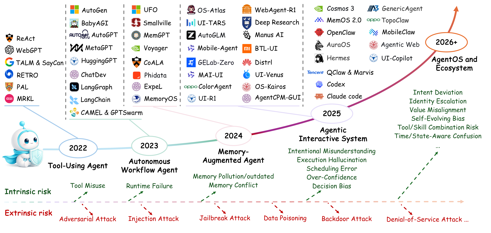

<h1 align="center">Behavior Safety of Autonomous Interactive Agents: Risks, Attacks, Defenses and Evaluation</h1>

  

## 🌟 Overview
Autonomous interactive agents are capable of long-horizon reasoning, autonomous decision-making, and continuous interaction with open environments and capability evolving. However, existing surveys remain fragmented across individual agent paradigms and safety topics, without a comprehensive understanding of behavioral safety in autonomous interactive agents. In this survey, we present a behavioral safety-centric overview of autonomous interactive agents, covering risks, attacks, defenses, and evaluation. We first investigate the intrinsic behavioral risks arising from insufficient capabilities and design deficiencies in foundation-model reasoning, memory mechanisms, tool use, and multi-agent collaboration, which can gradually deviate from user intentions throughout long-horizon interactions. Building upon these intrinsic vulnerabilities, we further review how adversaries manipulate agent decision-making through data supply chains, user inputs, interaction environments, and collaborating agents, ultimately steering agents toward unsafe or unauthorized behaviors. To systematically understand behavioral safety, we theoretically characterize the coupling between behavioral safety, agent autonomy, and interactivity through the proposed Agentic COB metric. Beyond risks and attacks, we examine how behavioral safety from community ecosystems, including protocols, third-party extensions, and skills, as well as runtime systems, where failures in resource management, isolation, and execution control may undermine system-level safeguards. We correspondingly summarize representative behavioral safety constraints and guidance mechanisms across different threat models, and categorize existing benchmarks from the perspectives of intrinsic behavioral safety and extrinsic behavioral attacks, highlighting the importance of behavioral awareness and trajectory-level evaluation. By establishing a unified behavioral safety-centric perspective, this survey lays the foundation for developing reliable, controllable, and trustworthy autonomous interactive agents and collaborative agent ecosystems.

📄 Paper link: [Behavior Safety of Autonomous Interactive Agents: Risks, Attacks, Defenses and Evaluation]()

## 🧾Paper List

  
📂 Table of Contents<em>(click to expand/collapse)</em>

  <ul>
    <li><a href="#intrinsic-cognitive-vulnerability">Intrinsic Cognitive Vulnerability</a>
      <ul>
        <li><a href="#foundation-model-vulnerability">Foundation Model Vulnerability</a>
          <ul>
            <li><a href="#behavioral-objective-deviation">Behavioral Objective Deviation</a></li>
            <li><a href="#memory-shortcuts">Memory Shortcuts</a></li>
            <li><a href="#infinite-planning-loop">Infinite Planning Loop</a></li>
            <li><a href="#reflective-rigidity">Reflective Rigidity</a></li>
            <li><a href="#intention-drift">Intention Drift</a></li>
          </ul>
        <li><a href="#memory-vulnerability">Memory Vulnerability</a>
          <ul>
            <li><a href="#memory-contamination">Memory Contamination</a></li>
            <li><a href="#memory-conflict">Memory Conflict</a></li>
            <li><a href="#memory-misevolution">Memory Misevolution</a></li>
          </ul>
        <li><a href="#tool-invocation-vulnerability">Tool-invocation Vulnerability</a>
        <li><a href="#multi-agent collaboration vulnerability">Multi-agent Collaboration Vulnerability</a>
        </li>
      </ul>
    </li>
    <li><a href="#extrinsic-loss-of-control risk">Extrinsic Loss-of-control Risk</a>
      <ul>
        <li><a href="#supply-chain-manipulation">Supply-Chain Manipulation</a>
          <ul>
            <li><a href="#data-poisoning">Data Poisoning</a></li>
            <li><a href="#backdoor-attacks">backdoor attacks</a></li>
          </ul>
        </li>
        <li><a href="#user-level-manipulation">User-Level Manipulation</a>
          <ul>
            <li><a href="#direct-prompt-injection">Direct Prompt Injection</a></li>
            <li><a href="#jailbreak-jailbreak">Jailbreak Jailbreak</a></li>
            <li><a href="#long-horizon-manipulation">Long-Horizon Manipulation</a></li>
          </ul>
        </li>
        <li><a href="#environment-level-manipulation">Environment-Level Manipulation</a>
          <ul>
            <li><a href="#indirect-prompt-injection">Indirect Prompt Injection</a></li>
            <li><a href="#retrieval-poisoning">Retrieval Poisoning</a></li>
            <li><a href="#memory-poisoning">Memory Poisoning</a></li>
          </ul>
        </li>
        <li><a href="#cross-agent-interaction-risks">Cross-Agent Interaction Risks</a>
          <ul>
            <li><a href="#collusion">Collusion</a></li>
            <li><a href="#worm-propagation">Worm Propagation</a></li>
          </ul>
        </li>
      </ul>
    </li>
    <li><a href="#community-safety">Community Safety</a>
      <ul>
        <li><a href="#communication-protocol-risks">Communication Protocol Risks</a></li>
        <li><a href="#third-party-extension-risks">Third-Party Extension Risks</a></li>
        <li><a href="#skill-risks">Skill Riskss</a></li>
      </ul>
    </li>
    <li><a href="#system-safety">System Safety</a>
      <ul>
        <li><a href="#resource-exhaustion">Resource Exhaustion</a></li>
        <li><a href="#isolation-and-permission-failures">Isolation and Permission Failures</a></li>
      </ul>
    </li>
    <li><a href="#evaluation">Evaluation</a>
      <ul>
        <li><a href="#intrinsic-safety-benchmarks">Intrinsic Safety Benchmarks</a></li>
        <li><a href="#extrinsic-attack-benchmarks">Extrinsic Attack Benchmarks</a></li>
      </ul>
    </li>
  </ul>

#  Intrinsic Cognitive Vulnerability
* (2024) [Ai agents under threat: A  survey of key security challenges and future pathways]((https://arxiv.org/pdf/2406.02630))
* (2024) [The Emerged Security and Privacy of LLM Agent: A Survey with Case Studies](https://arxiv.org/abs/2407.19354)
* (2024) [Me, Myself, and AI: The Situational Awareness Dataset (SAD) for LLMs](https://proceedings.neurips.cc/paper_files/paper/2024/file/7537726385a4a6f94321e3adf8bd827e-Paper-Datasets_and_Benchmarks_Track.pdf)

###  Foundation Model Vulnerability

#####  Behavioral Objective Deviation
* (2025) [AgentMisalignment: Measuring the Propensity for Misaligned Behaviour in LLM-Based Agents](https://arxiv.org/abs/2506.04018)
* (2025) [LLM-based Agents Suffer from Hallucinations: A Survey of Taxonomy, Methods, and Directions](https://arxiv.org/abs/2509.18970)
* (2026) [AgentHallu: Benchmarking Automated Hallucination Attribution of LLM-based Agents](https://arxiv.org/html/2601.06818v1)
* (2024) [THaMES: An End-to-End Tool for Hallucination Mitigation and Evaluation in Large Language Models](https://arxiv.org/abs/2409.11353)
* (2024) [FreshLLMs: Refreshing Large Language Models with Search Engine Augmentation](https://arxiv.org/abs/2310.03214)
* (2023) [Enhancing zero-shot chain-of-thought reasoning in large language models through logic](https://arxiv.org/abs/2309.13339)
* (2023) [Chain-of-Verification Reduces Hallucination in Large Language Models](https://arxiv.org/abs/2309.11495)
* (2024) [Learning to Trust Your Feelings: Leveraging Self-awareness in LLMs for Hallucination Mitigation](https://arxiv.org/abs/2401.15449)
* (2024) [SaySelf: Teaching LLMs to Express Confidence with Self-Reflective Rationales](https://arxiv.org/abs/2405.20974)
* (2025) [Hallucination Mitigation using Agentic AI Natural Language-Based Frameworks](https://arxiv.org/abs/2501.13946)
* (2025) [EH-Benchmark Ophthalmic Hallucination Benchmark and Agent-Driven Top-Down Traceable Reasoning Workflow](https://arxiv.org/abs/2507.22929)
* (2025) [Large Language Models Hallucination: A Comprehensive Survey](http://arxiv.org/abs/2510.06265)
* (2024) [Artificial intelligence and increasing misinformation](https://www.cambridge.org/core/journals/the-british-journal-of-psychiatry/article/artificial-intelligence-and-increasing-misinformation/DCCE0EB214E3D375A3006AA69FFB210D)
* (2023) [LM vs LM: Detecting Factual Errors via Cross Examination](https://arxiv.org/abs/2305.13281)
* (2024) [RAC: Efficient LLM Factuality Correction with Retrieval Augmentation](https://arxiv.org/abs/2410.15667)
* (2025) [Improving Factuality with Explicit Working Memory](https://arxiv.org/abs/2412.18069)
* (2025) [Bias recognition and mitigation strategies in artificial intelligence healthcare applications](https://www.nature.com/articles/s41746-025-01503-7)
* (2025) [Ethical and Bias Considerations in Artificial Intelligence/Machine Learning](https://www.sciencedirect.com/science/article/pii/S0893395224002667)
* (2024) [Self-Debiasing Large Language Models: Zero-Shot Recognition and Reduction of Stereotypes](https://arxiv.org/abs/2402.01981)
* (2025) [Social Debiasing for Fair Multi-modal LLMs](https://arxiv.org/abs/2408.06569)
* (2024) [A Multi-LLM Debiasing Framework](https://arxiv.org/abs/2409.13884)
* (2025) [Mitigating Social Bias in Large Language Models: A Multi-Objective Approach within a Multi-Agent Framework](https://arxiv.org/abs/2412.15504)
* (2025) [Safety Tax: Safety Alignment Makes Your Large Reasoning Models Less Reasonable](https://arxiv.org/abs/2503.00555)
* (2024) [Deliberative Alignment: Reasoning Enables Safer Language Models](https://arxiv.org/abs/2412.16339)
* (2025) [SafeConstellations: Steering LLM Safety to Reduce Over-Refusals Through Task-Specific Trajectory](https://arxiv.org/html/2508.11290v1)
* (2025) [AgentAlign: Navigating Safety Alignment in the Shift from Informative to Agentic Large Language Models](https://arxiv.org/abs/2505.23020)
* (2026) [On-Policy Self-Evolution via Failure Trajectories for Agentic Safety Alignment](https://arxiv.org/abs/2605.11882)

#####  Memory Shortcuts
* (2023) [Large Language Models Can be Lazy Learners: Analyze Shortcuts in In-Context Learning](https://arxiv.org/abs/2305.17256)
* (2023) [Shortcut Learning of Large Language Models in Natural Language Understanding](https://arxiv.org/abs/2208.11857)
* (2024) ["My agent understands me better": Integrating Dynamic Human-like Memory Recall and Consolidation in LLM-Based Agents](https://arxiv.org/abs/2404.00573)
* (2024) [Needle in the Haystack for Memory Based Large Language Models](https://arxiv.org/abs/2407.01437)
* (2026) [The Trap of Trajectory: Towards Understanding and Mitigating Spurious Correlations in Agentic Memory](https://arxiv.org/abs/2605.09330)
* (2024) [Larimar: Large Language Models with Episodic Memory Control](https://arxiv.org/abs/2403.11901)
* (2024) [HiAgent: Hierarchical Working Memory Management for Solving Long-Horizon Agent Tasks with Large Language Model](https://arxiv.org/abs/2408.09559)
* (2025) [A2AS: Agentic AI Runtime Security and Self-Defense](https://arxiv.org/abs/2510.13825)

#####  Infinite Planning Loop
* (2024) [Revealing the Barriers of Language Agents in Planning](https://arxiv.org/abs/2410.12409)
* (2025) [Path Coordination for Robust, Fast, and Scalable Multi-Agent Path Finding Under Unforeseen Delays](https://ieeexplore.ieee.org/abstract/document/11185122)
* (2025) [On the Limits of Innate Planning in Large Language Models](https://arxiv.org/abs/2511.21591)
* (2026) [The cognitive companion: a lightweight parallel monitoring architecture for detecting and recovering from reasoning degradation in LLM agents](https://arxiv.org/abs/2604.13759)
* (2025) [Evaluating Uncertainty-based Failure Detection for Closed-Loop LLM Planners](https://arxiv.org/abs/2406.00430)
* (2025) [ALAS: Transactional and Dynamic Multi-Agent LLM Planning](https://arxiv.org/abs/2511.03094)
* (2025) [On the Limits of Innate Planning in Large Language Models](https://arxiv.org/abs/2511.21591)
* (2025) [Agent-Oriented Planning in Multi-Agent Systems](https://arxiv.org/abs/2410.02189)

#####  Reflective Rigidity
* (2024) [Self-Contrast: Better Reflection Through Inconsistent Solving Perspectives](https://aclanthology.org/2024.acl-long.197.pdf)
* (2025) [Illusions of reflection: open-ended task reveals systematic failures in Large Language Models' reflective reasoning](https://arxiv.org/abs/2510.18254)
* (2023) [Self-Correction Bench: Uncovering and Addressing the Self-Correction Blind Spot in Large Language Models](https://arxiv.org/abs/2507.02778)
* (2026) [Think Fast and Slow: Step-Level Cognitive Depth Adaptation for LLM Agents](https://arxiv.org/abs/2602.12662)
* (2026) [Mitigating Cognitive Inertia in Large Reasoning Models via Latent Spike Steering](https://arxiv.org/abs/2601.22484)

#####  Intention Drift
* (2025) [Technical Report: Evaluating Goal Drift in Language Model Agents](https://arxiv.org/abs/2505.02709)
* (2026) [The Causal Impact of Tool Affordance on Safety Alignment in LLM Agents](https://arxiv.org/abs/2603.20320)
* (2024) [Semantic Drift Mitigation in Large Language Model Knowledge Retention Using the Residual Knowledge Stability Concept](https://www.techrxiv.org/doi/full/10.36227/techrxiv.173091142.28945162/v1)
* (2026) [Agent Drift: Quantifying Behavioral Degradation in Multi-Agent LLM Systems Over Extended Interactions](https://arxiv.org/abs/2601.04170)
* (2026) [Alignment Tipping Process: How Self-Evolution Pushes LLM Agents Off the Rails](https://arxiv.org/pdf/2510.04860?)
* (2025) [Stay Focused: Problem Drift in Multi-Agent Debate](https://arxiv.org/abs/2502.19559)
* (2026) [Drift-Bench: Diagnosing Cooperative Breakdowns in LLM Agents under Input Faults via Multi-Turn Interaction](https://arxiv.org/abs/2602.02455)
* (2026) [Detecting and Repairing Role Drift in Multi-Agent Collaboration with Lightweight Protocols](https://ieeexplore.ieee.org/document/11453032)
* (2025) [A Survey on Autonomy-Induced Security Risks in Large Model-Based Agents](https://arxiv.org/abs/2506.23844)
* (2026) [PersonalAlign: Hierarchical Implicit Intent Alignment for Personalized GUI Agent with Long-Term User-Centric Records](https://arxiv.org/html/2601.09636v1)

###  Memory Vulnerability

#####  Memory Contamination
* (2026) [Memory Poisoning Propagation and Repair Mechanism in Multi-Agent Collaborative Environments](https://dl.acm.org/doi/10.1145/3806262.3806294)
* (2026) [Remembering More, Risking More: Longitudinal Safety Risks in Memory-Equipped LLM Agents](https://arxiv.org/abs/2605.17830)
* (2024) [INMS: Memory Sharing for Large Language Model based Agents](https://arxiv.org/abs/2404.09982)
* (2026) [Mind Your HEARTBEAT! Claw Background Execution Inherently Enables Silent Memory Pollution](https://arxiv.org/abs/2603.23064)
* (2026) [Governing Evolving Memory in LLM Agents: Risks, Mechanisms, and the Stability and Safety Governed Memory (SSGM) Framework](https://arxiv.org/abs/2603.11768)
* (2026) [No Attacker Needed: Unintentional Cross-User Contamination in Shared-State LLM Agents](https://arxiv.org/abs/2604.01350)

#####  Memory Conflict
* (2024) [A Survey on the Memory Mechanism of Large Language Model based Agents](https://arxiv.org/abs/2404.13501)
* (2026) [MemConflict: Evaluating Long-Term Memory Systems Under Memory Conflicts](https://arxiv.org/abs/2605.20926)
* (2025) [Mem0: Building Production-Ready AI Agents with Scalable Long-Term Memory](https://arxiv.org/abs/2504.19413)
* (2026) [Memory-R1: Enhancing Large Language Model Agents to Manage and Utilize Memories via Reinforcement Learning](https://arxiv.org/abs/2508.19828)
* (2026) [Evaluating Memory in LLM Agents via Incremental Multi-Turn Interactions](https://arxiv.org/abs/2507.05257)
* (2025) [Zep: A Temporal Knowledge Graph Architecture for Agent Memory](https://arxiv.org/abs/2501.13956)
* (2026) [Memory for Autonomous LLM Agents:Mechanisms, Evaluation, and Emerging Frontiers](https://arxiv.org/abs/2603.07670)
* (2025) [Towards Lifelong Dialogue Agents via Timeline-based Memory Management](https://arxiv.org/abs/2406.10996)

#####  Memory Misevolution
* (2026) [From Storage to Experience: A Survey on the Evolution of LLM Agent Memory Mechanisms](https://arxiv.org/abs/2605.06716)
* (2026) [When Routine Chats Turn Toxic: Unintended Long-Term State Poisoning in Personalized Agent](https://arxiv.org/abs/2605.06731)
* (2025) [Your Agent May Misevolve: Emergent Risks in Self-evolving LLM Agents](https://arxiv.org/abs/2509.26354)
* (2026) [Useful Memories Become Faulty When Continuously Updated by LLMs](https://arxiv.org/abs/2605.12978)
* (2026) [Contextual Agentic Memory is a Memo, Not True Memory](https://arxiv.org/abs/2604.27707)
* (2026) [M⋆: Every Task Deserves Its Own Memory Harness](https://arxiv.org/abs/2604.11811)
* (2026) [Cognitive Autonomous Memory Security (CAMS) against injection and extraction attacks in long-term memory of AI agents](https://www.sciencedirect.com/science/article/pii/S1110866526001003)

###  Tool-invocation Vulnerability
* (2026) [AgenTRIM: Tool Risk Mitigation for Agentic AI](https://arxiv.org/abs/2601.12449)
* (2026) [ToolSafe: Enhancing Tool Invocation Safety of LLM-based agents via Proactive Step-level Guardrail and Feedback](https://arxiv.org/abs/2601.10156)
* (2025) [Securing GenAI Multi-Agent Systems Against Tool Squatting: A Zero Trust Registry-Based Approach](https://arxiv.org/abs/2504.19951)
* (2025) [Position: Agent Should Invoke External Tools ONLY When Epistemically Necessary](https://arxiv.org/abs/2506.00886)
* (2025) [SMART: Self-Aware Agent for Tool Overuse Mitigation](https://arxiv.org/abs/2502.11435)
* (2025) [More Vulnerable than You Think: On the Stability of Tool-Integrated LLM Agents](https://arxiv.org/abs/2506.21967)
* (2025) [STAC: When Innocent Tools Form Dangerous Chains to Jailbreak LLM Agents](https://arxiv.org/abs/2509.25624)
* (2024) [ToolSword: Unveiling Safety Issues of Large Language Models in Tool Learning Across Three Stages](https://arxiv.org/abs/2402.10753)
* (2025) [ToolFuzz -- Automated Agent Tool Testing](https://arxiv.org/abs/2503.04479)
* (2026) [When Agents Fail to Act: A Diagnostic Framework for Tool Invocation Reliability in Multi-Agent LLM Systems](https://arxiv.org/abs/2601.16280)
* (2026) [Act Wisely: Cultivating Meta-Cognitive Tool Use in Agentic Multimodal Models](https://arxiv.org/abs/2604.08545)

###  Multi-agent Collaboration Vulnerability
* (2024) [On the Resilience of LLM-Based Multi-Agent Collaboration with Faulty Agents](https://arxiv.org/abs/2408.00989)
* (2025) [Multi-Agent Collaboration Mechanisms: A Survey of LLMs](https://arxiv.org/abs/2501.06322)
* (2025) [SentinelAgent: Graph-based Anomaly Detection in Multi-Agent Systems](https://arxiv.org/abs/2505.24201)
* (2026) [Security Considerations for Multi-agent Systems](https://arxiv.org/abs/2603.09002)
* (2025) [Multi-Agent Risks from Advanced AI](https://arxiv.org/abs/2502.14143)
* (2025) [The Trust Paradox in LLM-Based Multi-Agent Systems: When Collaboration Becomes a Security Vulnerability](https://arxiv.org/abs/2510.18563)
* (2026) [Multi-Agent Orchestration: Coordination, Trust, and Cascading Failures](https://papers.ssrn.com/sol3/papers.cfm?abstract_id=6734798)
* (2025) [Safety and Risk Pathways in Cooperative Generative Multi-Agent Systems: A Telecom Perspective](https://arxiv.org/abs/2511.17730)
* (2025) [A Comprehensive Survey on Multi-Agent Cooperative Decision-Making: Scenarios, Approaches, Challenges and Perspectives](https://arxiv.org/abs/2503.13415)
* (2026) [Agent Drift: Quantifying Behavioral Degradation in Multi-Agent LLM Systems Over Extended Interactions](https://arxiv.org/abs/2601.04170)
* (2026) [When Agents Fail to Act: A Diagnostic Framework for Tool Invocation Reliability in Multi-Agent LLM Systems]
* (2025) [Can Competition Enhance the Proficiency of Agents Powered by Large Language Models in the Realm of News-driven Time Series Forecasting?](https://arxiv.org/abs/2504.10210)
* (2024) [The Hunger Game Debate: On the Emergence of Over-Competition in Multi-Agent Systems](https://arxiv.org/abs/2509.26126)
* (2025) [M2I2: Learning Efficient Multi-Agent Communication via Masked State Modeling and Intention Inference](https://arxiv.org/abs/2501.00312)
* (2025) [Can Competition Enhance the Proficiency of Agents Powered by Large Language Models in the Realm of News-driven Time Series Forecasting?]
* (2025) [Agentic AI Security: Threats, Defenses, Evaluation, and Open Challenges](https://arxiv.org/abs/2510.23883)
* (2025) [AgentNet: Decentralized Evolutionary Coordination for LLM-based Multi-Agent Systems](https://arxiv.org/abs/2504.00587)
* (2026) [ProvAgent: Threat Detection Based on Identity-Behavior Binding and Multi-Agent Collaborative Attack Investigation](https://arxiv.org/abs/2603.09358)

#  Extrinsic Loss-of-control Risk

###  Supply-Chain Manipulation

#####  Data Poisoning
* (2025) [Security of LLM-based agents regarding attacks, defenses, and applications: A comprehensive survey](https://www.sciencedirect.com/science/article/abs/pii/S1566253525010036)
* (2025) [PoisonBench: Assessing Large Language Model Vulnerability to Data Poisoning](https://arxiv.org/abs/2410.08811)
* (2026) [Threats and Defenses in Large Language Models: A Review of Adversarial and Model Poisoning Techniques](https://www.techrxiv.org/doi/full/10.36227/techrxiv.177040550.02084667/v1)
* (2025) [A Comprehensive Survey in LLM(-Agent) Full Stack Safety: Data, Training and Deployment](https://arxiv.org/abs/2504.15585)
* (2024) [The Emerged Security and Privacy of LLM Agent: A Survey with Case Studies](https://arxiv.org/abs/2407.19354)
* (2025) [Swallowing the Poison Pills: Insights from Vulnerability Disparity Among LLMs](https://arxiv.org/abs/2502.18518)
* (2026) [Trustworthy AI-Driven Dynamic Hybrid RIS: Joint Optimization and Reward Poisoning-Resilient Control in Cognitive MISO Networks](https://arxiv.org/abs/2604.01238)
* (2025) [Targeted Poisoning of Reinforcement Learning Agents](https://openreview.net/forum?id=GrFogzE5N9)
* (2024) [Preference Poisoning Attacks on Reward Model Learning](https://arxiv.org/abs/2402.01920)
* (2025) [Poisoning Attacks to Local Differential Privacy Protocols for Trajectory Data](https://arxiv.org/abs/2503.07483)
* (2026) [Security of Large Model-based Agents: A Survey on Adversarial, Poisoning, and Backdoor Attacks](https://www.techrxiv.org/doi/full/10.36227/techrxiv.177006506.61959855/v1)
* (2025) [Provable Watermarking for Data Poisoning Attacks](https://arxiv.org/abs/2510.09210)

#####  Backdoor Attacks
* (2026) [BackdoorAgent: A Unified Framework for Backdoor Attacks on LLM-based Agents](https://arxiv.org/abs/2601.04566)
* (2024) [BadAgent: Inserting and Activating Backdoor Attacks in LLM Agents](https://arxiv.org/abs/2406.03007)
* (2024) [Watch Out for Your Agents! Investigating Backdoor Threats to LLM-Based Agents](https://arxiv.org/abs/2402.11208)
* (2025) [Chain-of-Trigger: An Agentic Backdoor that Paradoxically Enhances Agentic Robustness](https://arxiv.org/abs/2510.08238)
* (2024) [AgentPoison: Red-teaming LLM Agents via Poisoning Memory or Knowledge Bases](https://arxiv.org/abs/2407.12784)
* (2025) [DemonAgent: Dynamically Encrypted Multi-Backdoor Implantation Attack on LLM-based Agent](https://arxiv.org/abs/2502.12575)
* (2026) [SkillTrojan: Backdoor Attacks on Skill-Based Agent Systems](https://arxiv.org/abs/2604.06811)
* (2025) [Collaborative Shadows: Distributed Backdoor Attacks in LLM-Based Multi-Agent Systems](https://arxiv.org/abs/2510.11246)
* (2025) [Poison Once, Control Anywhere: Clean-Text Visual Backdoors in VLM-based Mobile Agents](https://arxiv.org/abs/2506.13205)
* (2025) [Hidden Ghost Hand: Unveiling Backdoor Vulnerabilities in MLLM-Powered Mobile GUI Agents](https://arxiv.org/abs/2505.14418)
* (2025) [VisualTrap: A Stealthy Backdoor Attack on GUI Agents via Visual Grounding Manipulation](https://arxiv.org/abs/2507.06899)
* (2026) [SlowBA: An efficiency backdoor attack towards VLM-based GUI agents](https://arxiv.org/abs/2603.08316)
* (2025) [Your Agent Can Defend Itself against Backdoor Attacks](https://arxiv.org/abs/2506.08336)
* (2025) [A-MemGuard: A Proactive Defense Framework for LLM-Based Agent Memory](https://arxiv.org/abs/2510.02373)

###  User-Level Manipulation

#####  Direct Prompt Injection
* (2026) [Prompt Injection Attacks in Large Language Models and AI Agent Systems: A Comprehensive Review of Vulnerabilities, Attack Vectors, and Defense Mechanisms](https://www.mdpi.com/2078-2489/17/1/54)
* (2025) [Prompt Injection 2.0: Hybrid AI Threats](https://arxiv.org/abs/2507.13169)
* (2026) [A white-box prompt injection attack on embodied AI agents driven by large language models](https://www.sciencedirect.com/science/article/abs/pii/S0164121226000166)
* (2025) [To Protect the LLM Agent Against the Prompt Injection Attack with Polymorphic Prompt](https://arxiv.org/abs/2506.05739)
* (2025) [AegisAgent: An Autonomous Defense Agent Against Prompt Injection Attacks in LLM-HARs](https://arxiv.org/abs/2512.20986)
* (2025) [A Multi-Agent LLM Defense Pipeline Against Prompt Injection Attacks](https://arxiv.org/abs/2509.14285)
* (2025) [AgentArmor: Enforcing Program Analysis on Agent Runtime Trace to Defend Against Prompt Injection](https://arxiv.org/abs/2508.01249)
* (2025) [Prompt Injection Detection and Mitigation via AI Multi-Agent NLP Frameworks](https://arxiv.org/abs/2503.11517)
* (2026) [Agentic AI as a Cybersecurity Attack Surface: Threats, Exploits, and Defenses in Runtime Supply Chains](https://arxiv.org/html/2602.19555v1)

#####  Jailbreak Jailbreak
* (2026) [BadRobot: Jailbreaking Embodied LLM Agents in the Physical World](https://arxiv.org/abs/2407.20242)
* (2026) [Breaking the Code: Security Assessment of AI Code Agents Through Systematic Jailbreaking Attacks](https://arxiv.org/abs/2510.01359)
* (2025) [Safe in Isolation, Dangerous Together: Agent-Driven Multi-Turn Decomposition Jailbreaks on LLMs](https://aclanthology.org/2025.realm-1.13/)
* (2026) [David vs. Goliath: Verifiable Agent-to-Agent Jailbreaking via Reinforcement Learning](https://arxiv.org/abs/2602.02395)
* (2025) [X-Teaming: Multi-Turn Jailbreaks and Defenses with Adaptive Multi-Agents](https://arxiv.org/abs/2504.13203)
* (2025) [JPRO: Automated Multimodal Jailbreaking via Multi-Agent Collaboration Framework](https://arxiv.org/abs/2511.07315)
* (2025) [MetaCipher: A Time-Persistent and Universal Multi-Agent Framework for Cipher-Based Jailbreak Attacks for LLMs](https://arxiv.org/abs/2506.22557)
* (2025) [Fuzz-Testing Meets LLM-Based Agents: An Automated and Efficient Framework for Jailbreaking Text-To-Image Generation Models](https://arxiv.org/abs/2408.00523)
* (2026) [Every Picture Tells a Dangerous Story: Memory-Augmented Multi-Agent Jailbreak Attacks on VLMs](https://arxiv.org/abs/2604.12616)
* (2025) [Amplified Vulnerabilities: Structured Jailbreak Attacks on LLM-based Multi-Agent Debate](https://arxiv.org/abs/2504.16489)
* (2025) [SafeMobile: Chain-level Jailbreak Detection and Automated Evaluation for Multimodal Mobile Agents](https://arxiv.org/abs/2507.00841)
* (2025) [Guardians of the Agentic System: Preventing Many Shots Jailbreak with Agentic System](https://arxiv.org/abs/2502.16750)

#####  Long-Horizon Manipulation
* (2026) [AgentLAB: Benchmarking LLM Agents against Long-Horizon Attacks](https://arxiv.org/abs/2602.16901)
* (2026) [AI Agent Traps](https://papers.ssrn.com/sol3/papers.cfm?abstract_id=6372438)
* (2026) [LoopTrap: Termination Poisoning Attacks on LLM Agents](https://arxiv.org/abs/2605.05846)
* (2025) [STAC: When Innocent Tools Form Dangerous Chains to Jailbreak LLM Agents](https://arxiv.org/abs/2509.25624)
* (2026) [FlowSteer: Prompt-Only Workflow Steering Exposes Planning-Time Vulnerabilities in Multi-Agent LLM Systems](https://arxiv.org/abs/2605.11514)
* (2025) [Attack the Messages, Not the Agents: A Multi-round Adaptive Stealthy Tampering Framework for LLM-MAS](https://arxiv.org/abs/2508.03125)
* (2026) [MAGE: Safeguarding LLM Agents against Long-Horizon Threats via Shadow Memory](https://arxiv.org/abs/2605.03228)

###  Environment-Level Manipulation

#####  Indirect Prompt Injection
* (2026) [GUI-Actor: Coordinate-Free Visual Grounding for GUI Agents](https://arxiv.org/abs/2506.03143)
* (2024) [InjecAgent: Benchmarking Indirect Prompt Injections in Tool-Integrated Large Language Model Agents](https://arxiv.org/abs/2403.02691)
* (2025) [EchoLeak: The First Real-World Zero-Click Prompt Injection Exploit in a Production LLM System](https://arxiv.org/abs/2509.10540)
* (2025) [Simple Prompt Injection Attacks Can Leak Personal Data Observed by LLM Agents During Task Execution](https://arxiv.org/abs/2506.01055)
* (2026) [ChatInject: Abusing Chat Templates for Prompt Injection in LLM Agents](https://arxiv.org/abs/2509.22830)
* (2025) [TopicAttack: An Indirect Prompt Injection Attack via Topic Transition](https://arxiv.org/abs/2507.13686)
* (2025) [WebInject: Prompt Injection Attack to Web Agents](https://arxiv.org/abs/2505.11717)
* (2025) [Manipulating LLM Web Agents with Indirect Prompt Injection Attack via HTML Accessibility Tree](https://arxiv.org/abs/2507.14799)
* (2025) [Manipulating Multimodal Agents via Cross-Modal Prompt Injection](https://arxiv.org/abs/2504.14348)
* (2025) [AgentVigil: Generic Black-Box Red-teaming for Indirect Prompt Injection against LLM Agents](https://arxiv.org/abs/2505.05849)
* (2025) [EVA: Evolving Semantic Adversaries for Red-Teaming GUI Agents Against Environmental Injection Attacks](https://arxiv.org/abs/2505.14289)
* (2026) [MUZZLE: Adaptive Agentic Red-Teaming of Web Agents Against Indirect Prompt Injection Attacks](https://arxiv.org/abs/2602.09222)
* (2026) [AdapTools: Adaptive Tool-based Indirect Prompt Injection Attacks on Agentic LLMs](https://arxiv.org/abs/2602.20720)
* (2025) [QueryIPI: Query-agnostic Indirect Prompt Injection on Coding Agents](https://arxiv.org/abs/2510.23675)
* (2025) [PromptArmor: Simple yet Effective Prompt Injection Defenses](https://arxiv.org/abs/2507.15219)
* (2026) [CausalArmor: Efficient Indirect Prompt Injection Guardrails via Causal Attribution](https://arxiv.org/abs/2602.07918)
* (2026) [AttriGuard: Defeating Indirect Prompt Injection in LLM Agents via Causal Attribution of Tool Invocations](https://arxiv.org/abs/2603.10749)
* (2026) [PlanGuard: Defending Agents against Indirect Prompt Injection via Planning-based Consistency Verification](https://arxiv.org/abs/2604.10134)
* (2026) [AgentSys: Secure and Dynamic LLM Agents Through Explicit Hierarchical Memory Management](http://arxiv.org/abs/2602.07398)
* (2025) [IPIGuard: A Novel Tool Dependency Graph-Based Defense Against Indirect Prompt Injection in LLM Agents](https://arxiv.org/abs/2508.15310)
* (2025) [AgentBay: A Hybrid Interaction Sandbox for Seamless Human-AI Intervention in Agentic Systems](https://arxiv.org/abs/2512.04367)
* (2026) [SafeAgent: A Runtime Protection Architecture for Agentic Systems](https://arxiv.org/abs/2604.17562)
* (2025) [Design Patterns for Securing LLM Agents against Prompt Injections](https://arxiv.org/abs/2506.08837)
* (2025) [BrowseSafe: Understanding and Preventing Prompt Injection Within AI Browser Agents](https://arxiv.org/abs/2511.20597)
* (2024) [The Task Shield: Enforcing Task Alignment to Defend Against Indirect Prompt Injection in LLM Agents](https://arxiv.org/abs/2412.16682)
* (2025) [MELON: Provable Defense Against Indirect Prompt Injection Attacks in AI Agents](https://arxiv.org/abs/2502.05174)
* (2025) [Adaptive Attacks Break Defenses Against Indirect Prompt Injection Attacks on LLM Agents](https://arxiv.org/abs/2503.00061)
* (2026) [AgentSentry: Mitigating Indirect Prompt Injection in LLM Agents via Temporal Causal Diagnostics and Context Purification](https://arxiv.org/abs/2602.22724)
* (2026) [ICON: Indirect Prompt Injection Defense for Agents based on Inference-Time Correction](https://arxiv.org/abs/2602.20708)

#####  Retrieval Poisoning
* (2026) [Memory poisoning attacks on retrieval-augmented Large Language Model agents via deceptive semantic reasoning](https://www.sciencedirect.com/science/article/abs/pii/S0952197626002496)
* (2025) [PoisonArena: Uncovering Competing Poisoning Attacks in Retrieval-Augmented Generation](https://arxiv.org/html/2505.12574v1)
* (2025) [Exploring the Security Threats of Knowledge Base Poisoning in Retrieval-Augmented Code Generation](https://arxiv.org/abs/2502.03233)
* (2024) [PoisonedRAG: Knowledge Corruption Attacks to Retrieval-Augmented Generation of Large Language Models](https://arxiv.org/abs/2402.07867)
* (2025) [POISONCRAFT: Practical Poisoning of Retrieval-Augmented Generation for Large Language Models](https://arxiv.org/abs/2505.06579)
* (2025) [ADMIT: Few-shot Knowledge Poisoning Attacks on RAG-based Fact Checking](https://arxiv.org/abs/2510.13842)
* (2025) [Fact2Fiction: Targeted Poisoning Attack to Agentic Fact-checking System](https://arxiv.org/abs/2508.06059)
* (2025) [One Shot Dominance: Knowledge Poisoning Attack on Retrieval-Augmented Generation Systems](https://arxiv.org/abs/2505.11548)
* (2025) [Poisoned-MRAG: Knowledge Poisoning Attacks to Multimodal Retrieval Augmented Generation](https://arxiv.org/abs/2503.06254)
* (2025) [MM-PoisonRAG: Disrupting Multimodal RAG with Local and Global Poisoning Attacks](https://arxiv.org/abs/2502.17832)
* (2025) [PoisonedEye: Knowledge Poisoning Attack on Retrieval-Augmented Generation based Large Vision-Language Models](https://openreview.net/pdf?id=6SIymOqJlc)
* (2026) [KEPo: Knowledge Evolution Poison on Graph-based Retrieval-Augmented Generation](https://arxiv.org/abs/2603.11501)
* (2025) [Defending Against Knowledge Poisoning Attacks During Retrieval-Augmented Generation](https://arxiv.org/abs/2508.02835)
* (2025) [Who Taught the Lie? Responsibility Attribution for Poisoned Knowledge in Retrieval-Augmented Generation](https://arxiv.org/abs/2509.13772)
* (2025) [Traceback of Poisoning Attacks to Retrieval-Augmented Generation](https://arxiv.org/abs/2504.21668)

#####  Memory Poisoning
* (2025) [OWASP Top 10 for LLM Apps & Gen AI Agentic Security Initiative](https://hal.science/hal-04985337v1/file/Agentic-AI-Threats-and-Mitigations_v1.0.1.pdf)
* (2026) [Security of Large Model-based Agents: A Survey on Adversarial, Poisoning, and Backdoor Attacks](https://www.techrxiv.org/doi/full/10.36227/techrxiv.177006506.61959855/v1)
* (2025) [Unveiling Privacy Risks in LLM Agent Memory](https://arxiv.org/abs/2502.13172)
* (2025) [Real AI Agents with Fake Memories: Fatal Context Manipulation Attacks on Web3 Agents](https://arxiv.org/abs/2503.16248)
* (2026) [InjecMEM: Memory Injection Attack on LLM Agent Memory Systems](https://openreview.net/forum?id=QVX6hcJ2um)
* (2025) [Memory Injection Attacks on LLM Agents via Query-Only Interaction](https://arxiv.org/abs/2503.03704)
* (2026) [Poison Once, Exploit Forever: Environment-Injected Memory Poisoning Attacks on Web Agents](https://arxiv.org/abs/2604.02623)
* (2025) [Context manipulation attacks : Web agents are susceptible to corrupted memory](https://arxiv.org/abs/2506.17318)
* (2025) [MemoryGraft: Persistent Compromise of LLM Agents via Poisoned Experience Retrieval](https://arxiv.org/abs/2512.16962)
* (2026) [From Storage to Steering: Memory Control Flow Attacks on LLM Agents](https://arxiv.org/abs/2603.15125)
* (2026) [Memory poisoning attacks on retrieval-augmented Large Language Model agents via deceptive semantic reasoning](https://www.sciencedirect.com/science/article/abs/pii/S0952197626002496)
* (2024) [AgentPoison: Red-teaming LLM Agents via Poisoning Memory or Knowledge Bases](https://arxiv.org/abs/2407.12784)
* (2026) [MemVenom: Triggered Poisoning of Multimodal Memories in Web Agents](https://arxiv.org/abs/2606.10742)
* (2025) [DrunkAgent: Stealthy Memory Corruption in LLM-Powered Recommender Agents](https://arxiv.org/abs/2503.23804)
* (2026) [ShadowMerge: A Novel Poisoning Attack on Graph-Based Agent Memory via Relation-Channel Conflicts](https://arxiv.org/html/2605.09033v3)
* (2026) [Hidden in Memory: Sleeper Memory Poisoning in LLM Agents](https://arxiv.org/abs/2605.15338)
* (2026) [Zombie Agents: Persistent Control of Self-Evolving LLM Agents via Self-Reinforcing Injections](https://arxiv.org/abs/2602.15654)
* (2026) [Visual Inception: Compromising Long-term Planning in Agentic Recommenders via Multimodal Memory Poisoning](https://arxiv.org/abs/2604.16966)
* (2026) [Memory poisoning and secure multi-agent systems](https://arxiv.org/abs/2603.20357)
* (2026) [SuperLocalMemory: Privacy-Preserving Multi-Agent Memory with Bayesian Trust Defense Against Memory Poisonings](https://arxiv.org/abs/2603.02240)
* (2026) [Memory Poisoning Propagation and Repair Mechanism in Multi-Agent Collaborative Environments](https://dl.acm.org/doi/10.1145/3806262.3806294)
* (2025) [A-MemGuard: A Proactive Defense Framework for LLM-Based Agent Memory](https://arxiv.org/abs/2510.02373)

###  Cross-Agent Interaction Risks

#####  Collusion
* (2025) [A Survey of Collusion Risk in LLM-Powered Multi-Agent Systems](https://openreview.net/challenge?redirect=%2Fforum%3Fid%3DYlh8617Qyd)
* (2026) [On the Fragility of AI Agent Collusion](https://arxiv.org/abs/2603.20281)
* (2025) [Evaluating LLM Agent Collusion in Double Auctions](https://arxiv.org/abs/2507.01413)
* (2025) [Beyond Human Intervention: Algorithmic Collusion through Multi-Agent Learning Strategies](https://arxiv.org/abs/2501.16935)
* (2026) [Mapping Human Anti-collusion Mechanisms to Multi-agent AI Systems](https://arxiv.org/abs/2601.00360)
* (2026) [Institutional AI: Governing LLM Collusion in Multi-Agent Cournot Markets via Public Governance Graphs](https://arxiv.org/abs/2601.11369)
* (2026) [Colosseum: Auditing Collusion in Cooperative Multi-Agent Systems](https://arxiv.org/abs/2602.15198)
* (2025) [When Autonomy Goes Rogue: Preparing for Risks of Multi-Agent Collusion in Social Systems](https://arxiv.org/abs/2507.14660)
* (2025) [Audit the Whisper: Detecting Steganographic Collusion in Multi-Agent LLMs](https://arxiv.org/abs/2510.04303)
* (2026) [Detecting Multi-Agent Collusion Through Multi-Agent Interpretability](https://arxiv.org/abs/2604.01151)

#####  Worm Propagation
* (2025) [RepliBench: Evaluating the Autonomous Replication Capabilities of Language Model Agents](https://arxiv.org/abs/2504.18565)
* (2026) [Orchestration and Verification of Agentic AI Systems: A Survey of Multi-Agent Collaboration and Safety](https://www.researchgate.net/publication/403892898_Orchestration_and_Verification_of_Agentic_AI_Systems_A_Survey_of_Multi-Agent_Collaboration_and_Safety)
* (2026) [MASLeak: Investigating and Exposing Intellectual Property Leakage Vulnerabilities in Multi-Agent Systems](https://www.usenix.org/conference/usenixsecurity26/presentation/wang-liwen)
* (2025) [Here Comes The AI Worm: Unleashing Zero-click Worms that Target GenAI-Powered Applications](https://arxiv.org/abs/2403.02817)
* (2024) [Prompt Infection: LLM-to-LLM Prompt Injection within Multi-Agent Systems](https://arxiv.org/abs/2410.07283)
* (2026) [AI Agents Enable Adaptive Computer Worms](https://arxiv.org/abs/2606.03811)
* (2026) [AgentWorm: Self-Propagating Attacks Across LLM Agent Ecosystems](https://arxiv.org/abs/2603.15727)
* (2026) [Autonomous LLM Agent Worms: Cross-Platform Propagation, Automated Discovery and Temporal Re-Entry Defense](https://arxiv.org/abs/2605.02812)
* (2026) [Dynamics of defensive and malicious worm co-propagation across networked systems](https://www.sciencedirect.com/science/article/pii/S0960077925016029)
* (2025) [A Dynamic Countermeasure-Based Worm Propagation Model in Wireless Sensor Networks: Critical Threshold Analysis and Validation of Benign Worm Effectiveness](https://www.sciltp.com/journals/jmlis/articles/2509001307)
* (2026) [Uncertainty-Driven Probabilistic Framework for Modeling Worm Propagation in Large-Scale Network Topologies](https://www.researchgate.net/publication/404747824_Uncertainty-Driven_Probabilistic_Framework_for_Modeling_Worm_Propagation_in_Large-Scale_Network_Topologies)
* (2026) [Semantic Immunity: Embedding-Based Epidemiological DefenseAgainst Prompt Worms in Autonomous Agent Networks](https://gaiarobotics.com/Semantic_Immunity.pdf)

#  Community Safety

###  Communication Protocol Risks
* (2025) [We Should Identify and Mitigate Third-Party Safety Risks in MCP-Powered Agent Systems](https://arxiv.org/abs/2506.13666)
* (2025) [A survey of agent interoperability protocols: Model Context Protocol (MCP), Agent Communication Protocol (ACP), Agent-to-Agent Protocol (A2A), and Agent Network Protocol (ANP)](https://arxiv.org/abs/2505.02279)
* (2025) [When MCP Servers Attack: Taxonomy, Feasibility, and Mitigation](https://arxiv.org/abs/2509.24272)
* (2025) [Supply Chain Threats in the MCP Ecosystem: Attack Vectors and Mitigation Strategies](https://dl.acm.org/doi/10.1007/978-981-95-4674-9_17)
* (2025) [Beyond the Protocol: Unveiling Attack Vectors in the Model Context Protocol (MCP) Ecosystem](https://arxiv.org/abs/2506.02040)
* (2025) [MCPGuard : Automatically Detecting Vulnerabilities in MCP Servers](https://arxiv.org/abs/2510.23673)
* (2025) [Automatic Red Teaming LLM-based Agents with Model Context Protocol Tools](https://arxiv.org/abs/2509.21011)
* (2026) [MCP-ITP: An Automated Framework for Implicit Tool Poisoning in MCP](https://arxiv.org/abs/2601.073957)
* (2025) [MSA: A Cross-MCP Privacy Attack via Memory Exfiltration of Large Language Models](https://dl.acm.org/doi/10.1145/3733802.3764057)
* (2025) [MCP Safety Audit: LLMs with the Model Context Protocol Allow Major Security Exploits](https://arxiv.org/abs/2504.03767)
* (2025) [MPMA: Preference Manipulation Attack Against Model Context Protocol](https://arxiv.org/abs/2505.11154)
* (2026) [From Component Manipulation to System Compromise: Understanding and Detecting Malicious MCP Servers](https://arxiv.org/abs/2604.01905)
* (2026) [Technical Report: Exploring the Emerging Threats of the Agent Skill Ecosystem](https://arxiv.org/abs/2605.28588)
* (2026) [AI-Infra-Guard: A Comprehensive, Intelligent, and Easy-to-Use AI Red Teaming Platform](https://github.com/tencent/AI-Infra-Guard)
* (2026) [MCPXKIT: The Unified Toolkit for Analyzing Model Context Protocol Security](https://arxiv.org/abs/2508.12538)
* (2026) [Beyond Detection: Autonomous Anomaly Remediation for MCP Against Tool Poisoning Attacks](https://dl.acm.org/doi/10.1145/3774904.3792400)
* (2025) [MCIP: Protecting MCP Safety via Model Contextual Integrity Protocol](https://arxiv.org/abs/2505.14590)
* (2026) [When the Manual Lies: A Realistic Benchmark to Evaluate MCP Poisoning Attacks for LLM Agents](https://arxiv.org/abs/2605.24069)
* (2025) [Securing MCP-based Agent Workflows](https://dl.acm.org/doi/10.1145/3766882.3767177)
* (2025) [AgentBound: Securing Execution Boundaries of AI Agents](https://arxiv.org/abs/2510.21236)
* (2025) [MCP Guardian: A Security-First Layer for Safeguarding MCP-Based AI System](https://arxiv.org/abs/2504.12757)
* (2025) [AI MCP Servers in Cybersecurity: Emerging Attack Vectors and Mitigation Strategies](https://www.researchgate.net/publication/398807759_AI_MCP_Servers_in_Cybersecurity_Emerging_Attack_Vectors_and_Mitigation_Strategies)
* (2026) [ZT-MCP: A Zero-Trust Security Architecture for MCP-Connected AI Agents](https://www.researchgate.net/publication/404057994_ZT-MCP_A_Zero-Trust_Security_Architecture_for_MCP-Connected_AI_Agents)
* (2025) [Enterprise-Grade Security for the Model Context Protocol (MCP): Frameworks and Mitigation Strategies](https://arxiv.org/abs/2504.08623)
* (2026) [A Formal Security Framework for MCP-Based AI Agents: Threat Taxonomy, Verification Models, and Defense Mechanisms](https://arxiv.org/abs/2604.05969)

###  Third-Party Extension Risks
* (2025) [Securing GenAI Multi-Agent Systems Against Tool Squatting: A Zero Trust Registry-Based Approach](https://arxiv.org/abs/2504.19951)
* (2026) [MalTool: Malicious Tool Attacks on LLM Agents](https://arxiv.org/abs/2602.12194)
* (2025) [ToolTweak: An Attack on Tool Selection in LLM-based Agents](https://arxiv.org/abs/2510.02554)
* (2025) [FuncPoison: Poisoning Function Library to Hijack Multi-agent Autonomous Driving Systems](https://arxiv.org/abs/2509.24408)
* (2025) [Prompt Injection Attack to Tool Selection in LLM Agents](https://arxiv.org/abs/2504.19793)
* (2026) [VeriGrey: Greybox Agent Validation](https://arxiv.org/abs/2603.17639)
* (2026) [Sponge Tool Attack: Stealthy Denial-of-Efficiency against Tool-Augmented Agentic Reasoning](https://arxiv.org/abs/2601.17566)
* (2026) [Evo-Attacker: Memory-Augmented Reinforcement Learning for Long-Horizon Tool Attacks on LLM-MAS](https://arxiv.org/abs/2605.25389)
* (2026) [ToolSafe: Enhancing Tool Invocation Safety of LLM-based agents via Proactive Step-level Guardrail and Feedback](https://arxiv.org/abs/2601.10156)
* (2026) [VIGIL: Defending LLM Agents Against Tool Stream Injection via Verify-Before-Commit](https://arxiv.org/abs/2601.05755)
* (2026) [AgentTrust: Runtime Safety Evaluation and Interception for AI Agent Tool Use](https://arxiv.org/abs/2605.04785)
* (2025) [MindGuard: Tracking, Detecting, and Attributing MCP Tool Poisoning Attack via Decision Dependence Graph](https://arxiv.org/html/2508.20412v1)
* (2026) [SafeHarness: Lifecycle-Integrated Security Architecture for LLM-based Agent Deployment](https://arxiv.org/abs/2604.13630)

###  Skill Risks
* (2026) [SoK: Agentic Skills -- Beyond Tool Use in LLM Agents](https://arxiv.org/abs/2602.20867)
* (2026) [Agent Skills for Large Language Models: Architecture, Acquisition, Security, and the Path Forward](https://arxiv.org/abs/2602.12430)
* (2026) [Externalization in LLM Agents: A Unified Review of Memory, Skills, Protocols and Harness Engineering](https://arxiv.org/abs/2604.08224)
* (2026) [SkillAttack: Automated Red Teaming of Agent Skills through Attack Path Refinement](https://arxiv.org/abs/2604.04989)
* (2026) [Credential Leakage in LLM Agent Skills: A Large-Scale Empirical Study](https://arxiv.org/html/2604.03070v1)
* (2026) [Agent Skills in the Wild: An Empirical Study of Security Vulnerabilities at Scale](https://arxiv.org/abs/2601.10338)
* (2026) [Malicious Agent Skills in the Wild: A Large-Scale Security Empirical Study](https://arxiv.org/html/2602.06547v1)
* (2026) [Supply-Chain Poisoning Attacks Against LLM Coding Agent Skill Ecosystems](https://arxiv.org/abs/2604.03081)
* (2026) [Skill-Inject: Measuring Agent Vulnerability to Skill File Attacks](https://arxiv.org/abs/2602.20156)
* (2026) [SkillJect: Effectively Automating Skill-Based Prompt Injection for Skill-Enabled Agents](https://arxiv.org/abs/2602.14211)
* (2026) [BadSkill: Backdoor Attacks on Agent Skills via Model-in-Skill Poisoning](https://arxiv.org/abs/2604.09378)
* (2026) [Formal Analysis and Supply Chain Security for Agentic AI Skills](https://arxiv.org/abs/2603.00195)
* (2026) [Malicious Or Not: Adding Repository Context to Agent Skill Classification](https://arxiv.org/html/2603.16572v1)
* (2026) [SkillSieve: A Hierarchical Triage Framework for Detecting Malicious AI Agent Skills](https://arxiv.org/abs/2604.06550)
* (2026) [SkillProbe: Security Auditing for Emerging Agent Skill Marketplaces via Multi-Agent Collaboration](https://arxiv.org/abs/2603.21019)

#  System Safety

###  Resource Exhaustion
* (2025) [Thoughts Are All Over the Place: On the Underthinking of o1-Like LLMs](https://arxiv.org/abs/2501.18585)
* (2026) [Clawdrain: Exploiting Tool-Calling Chains for Stealthy Token Exhaustion in OpenClaw Agents](https://arxiv.org/abs/2603.00902)
* (2025) [ThinkTrap: Denial-of-Service Attacks against Black-box LLM Services via Infinite Thinking](https://arxiv.org/abs/2512.07086)
* (2025) [CORBA: Contagious Recursive Blocking Attacks on Multi-Agent Systems Based on Large Language Models](https://arxiv.org/abs/2502.14529)
* (2025) [Budget-Aware Tool-Use Enables Effective Agent Scaling](https://arxiv.org/abs/2511.17006)
* (2025) [Co-Saving: Resource Aware Multi-Agent Collaboration for Software Development](https://arxiv.org/abs/2505.21898)
* (2026) [AgentWard: A Lifecycle Security Architecture for Autonomous AI Agents](https://arxiv.org/abs/2604.24657)

#####  Isolation and Permission Failures
* (2026) [Taming Various Privilege Escalation in LLM-Based Agent Systems: A Mandatory Access Control Framework](https://arxiv.org/abs/2601.11893)
* (2023) [LLMs as Hackers: Autonomous Linux Privilege Escalation Attacks](https://arxiv.org/abs/2310.11409)
* (2026) [Post-Training Local LLM Agents for Linux Privilege Escalation with Verifiable Rewards](https://arxiv.org/html/2603.17673v1)
* (2026) [Enhancing Linux Privilege Escalation Attack Capabilities of Local LLM Agents](https://arxiv.org/abs/2604.27143)
* (2026) [When Lower Privileges Suffice: Investigating Over-Privileged Tool Selection in LLM Agents](https://arxiv.org/abs/2606.20023)
* (2026) [Cross-Session Threats in AI Agents: Benchmark, Evaluation, and Algorithms](https://arxiv.org/abs/2604.21131)
* (2025) [SentinelAgent: Graph-based Anomaly Detection in Multi-Agent Systems](https://arxiv.org/abs/2505.24201)
* (2024) [IsolateGPT: An Execution Isolation Architecture for LLM-Based Agentic Systems](https://arxiv.org/abs/2403.04960)
* (2025) [AgentSpec: Customizable Runtime Enforcement for Safe and Reliable LLM Agents](https://arxiv.org/abs/2503.18666)
* (2026) [ClawGuard: A Runtime Security Framework for Tool-Augmented LLM Agents Against Indirect Prompt Injection](https://arxiv.org/abs/2604.11790)
* (2025) [ceLLMate: Sandboxing Browser AI Agents](https://arxiv.org/abs/2512.12594)

#  Evaluation
* (2025) [GhostEI-Bench: Do Mobile Agents Resilience to Environmental Injection in Dynamic On-Device Environments?](https://arxiv.org/abs/2510.20333)
* (2026) [AgentCanary: A Security Evaluation Framework for Autonomous AI Agents in Real Executable Environments](https://arxiv.org/abs/2606.10484)
* (2026) [OS-SPEAR: A Toolkit for the Safety, Performance,Efficiency, and Robustness Analysis of OS Agents](https://arxiv.org/abs/2604.24348)

###  Intrinsic Safety Benchmarks
* (2025) [OS-Harm: A Benchmark for Measuring Safety of Computer Use Agents](https://arxiv.org/abs/2506.14866)
* (2026) [AgentHazard: A Benchmark for Evaluating Harmful Behavior in Computer-Use Agents](https://arxiv.org/abs/2604.02947)
* (2026) [LPS-Bench: Benchmarking Safety Awareness of Computer-Use Agents in Long-Horizon Planning under Benign and Adversarial Scenarios](https://arxiv.org/abs/2602.03255)
* (2026) [ToolSafe: Enhancing Tool Invocation Safety of LLM-based agents via Proactive Step-level Guardrail and Feedback](https://arxiv.org/abs/2601.10156)
* (2025) [IS-Bench: Evaluating Interactive Safety of VLM-Driven Embodied Agents in Daily Household Tasks](https://arxiv.org/abs/2506.16402)
* (2025) [AGENTSAFE: Benchmarking the Safety of Embodied Agents on Hazardous Instructions](https://arxiv.org/abs/2506.14697)
* (2025) [SafeMind: Benchmarking and Mitigating Safety Risks in Embodied LLM Agents](https://arxiv.org/abs/2509.25885)
* (2026) [Risky-Bench: Probing Agentic Safety Risks under Real-World Deployment](https://arxiv.org/abs/2602.03100)
* (2026) [ATBench: A Diverse and Realistic Agent Trajectory Benchmark for Safety Evaluation and Diagnosis](https://arxiv.org/abs/2604.02022)
* (2026) [Benchmarks for Trajectory Safety Evaluation and Diagnosis in OpenClaw and Codex: ATBench-Claw and ATBench-Codex](https://arxiv.org/abs/2604.14858)
* (2026) [Claw-Eval: Towards Trustworthy Evaluation of Autonomous Agents](https://arxiv.org/abs/2604.06132)
* (2026) [AgentAuditor: Human-Level Safety and Security Evaluation for LLM Agents](https://arxiv.org/abs/2506.00641)
* (2026) [HINTBench: Horizon-agent Intrinsic Non-attack Trajectory Benchmark](https://arxiv.org/abs/2604.13954)
* (2026) [AgentCanary: A Security Evaluation Framework for Autonomous AI Agents in Real Executable Environments](https://arxiv.org/abs/2606.10484)
* (2025) [MIRAGE-Bench: LLM Agent is Hallucinating and Where to Find Them](https://arxiv.org/abs/2507.21017)
* (2025) [EU-Agent-Bench: Measuring Illegal Behavior of LLM Agents Under EU Law](https://arxiv.org/abs/2510.21524)
* (2025) [OpenAgentSafety: A Comprehensive Framework for Evaluating Real-World AI Agent Safety](https://arxiv.org/abs/2507.06134)
* (2024) [MobileSafetyBench: Evaluating Safety of Autonomous Agents in Mobile Device Control](https://arxiv.org/abs/2410.17520)
* (2025) [RepliBench: Evaluating the Autonomous Replication Capabilities of Language Model Agents](https://arxiv.org/abs/2504.18565)
* (2024) [AgentHarm: A Benchmark for Measuring Harmfulness of LLM Agents](https://arxiv.org/abs/2410.09024)

#####  Extrinsic Attack Benchmarks
* (2025) [Benchmarking Poisoning Attacks against Retrieval-Augmented Generation](https://arxiv.org/abs/2505.18543)
* (2025) [PoisonArena: Uncovering Competing Poisoning Attacks in Retrieval-Augmented Generation](https://arxiv.org/html/2505.12574v1)
* (2025) [WAInjectBench: Benchmarking Prompt Injection Detections for Web Agents](https://arxiv.org/abs/2510.01354)
* (2025) [WASP: Benchmarking Web Agent Security Against Prompt Injection Attackss](https://arxiv.org/abs/2504.18575)
* (2026) [The Landscape of Prompt Injection Threats in LLM Agents: From Taxonomy to Analysis](https://arxiv.org/abs/2602.10453)
* (2026) [AgentDyn: Are Your Agent Security Defenses Deployable in Real-World Dynamic Environments?](https://arxiv.org/abs/2602.03117)
* (2025) [BrowseSafe: Understanding and Preventing Prompt Injection Within AI Browser Agents](https://arxiv.org/abs/2511.20597)
* (2024) [InjecAgent: Benchmarking Indirect Prompt Injections in Tool-Integrated Large Language Model Agents](https://arxiv.org/abs/2403.02691)
* (2024) [AgentDojo: A Dynamic Environment to Evaluate Prompt Injection Attacks and Defenses for LLM Agents](https://arxiv.org/abs/2406.13352)
* (2024) [Agent Security Bench (ASB): Formalizing and Benchmarking Attacks and Defenses in LLM-based Agents](hhttps://arxiv.org/abs/2410.02644)
* (2025) [VPI-Bench: Visual Prompt Injection Attacks for Computer-Use Agents](https://arxiv.org/abs/2506.02456)
* (2025) [GhostEI-Bench: Do Mobile Agents Resilience to Environmental Injection in Dynamic On-Device Environments?](https://arxiv.org/abs/2510.20333)
* (2025) [macOSWorld: A Multilingual Interactive Benchmark for GUI Agents](https://arxiv.org/abs/2506.04135)
* (2025) [Mobile GUI Agents under Real-world Threats: Are We There Yet?](https://arxiv.org/abs/2507.04227)
* (2026) [Skill-Inject: Measuring Agent Vulnerability to Skill File Attacks](https://arxiv.org/abs/2602.20156)
* (2026) [SkillSafetyBench: Evaluating Agent Safety under Skill-Facing Attack Surfaces](https://arxiv.org/abs/2605.12015)
* (2026) [HarmfulSkillBench: How Do Harmful Skills Weaponize Your Agents?](https://arxiv.org/abs/2604.15415)
* (2026) [MalSkillBench: A Runtime-Verified Benchmark of Malicious Agent Skills](https://arxiv.org/abs/2606.07131)
* (2025) [MCP Security Bench (MSB): Benchmarking Attacks Against Model Context Protocol in LLM Agents](https://arxiv.org/abs/2510.15994)
* (2025) [MCP-SafetyBench: A Benchmark for Safety Evaluation of Large Language Models with Real-World MCP Servers](https://arxiv.org/abs/2512.15163)
* (2026) [When the Manual Lies: A Realistic Benchmark to Evaluate MCP Poisoning Attacks for LLM Agents](https://arxiv.org/abs/2605.24069)
* (2025) [MCPTox: A Benchmark for Tool Poisoning Attack on Real-World MCP Servers](https://arxiv.org/abs/2508.14925)
* (2026) [VIGIL: Defending LLM Agents Against Tool Stream Injection via Verify-Before-Commit](https://arxiv.org/abs/2601.05755)
* (2026) [From Assistant to Double Agent: Formalizing and Benchmarking Attacks on OpenClaw for Personalized Local AI Agent](https://arxiv.org/abs/2602.08412)
* (2026) [A2ASecBench: A Protocol-Aware Security Benchmark for Agent-to-Agent Multi-Agent Systems](https://openreview.net/pdf?id=LfdFnakqGJ)
* (2026) [AgentLAB: Benchmarking LLM Agents against Long-Horizon Attacks](https://arxiv.org/abs/2602.16901)
* (2026) [From Prompt Injection to Persistent Control: Defending Agentic Harness Against Trojan Backdoors](https://arxiv.org/abs/2605.31042)
* (2026) [Benchmarking Autonomous Agents against Temporal, Spatial, and Semantic Evasions](https://arxiv.org/abs/2605.22321)
* (2026) [Every Picture Tells a Dangerous Story: Memory-Augmented Multi-Agent Jailbreak Attacks on VLMs](https://arxiv.org/abs/2604.12616)
* (2025) [Security Challenges in AI Agent Deployment: Insights from a Large Scale Public Competition](https://arxiv.org/abs/2507.20526)
* (2026) [AgentRedBench: Dynamic Redteaming and Integration-Aware Defense for LLM Agents over SaaS Integrations](https://arxiv.org/abs/2606.02240)
* (2026) [Hidden in Plain Sight: Benchmarking Agent Safety Against Decomposition Attacks with DECOMPBENCH](https://arxiv.org/abs/2606.13994)
* (2026) [Red-Teaming Agent Execution Contexts: Open-World Security Evaluation on OpenClaw](https://arxiv.org/abs/2605.11047)

